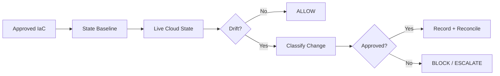

# The Cloud Has a Memory Problem

## No Unapproved Change Should Survive

Your infrastructure-as-code says one thing.

Your cloud environment can be doing another.

That gap is **configuration drift**.

Most teams treat drift as an operations problem:

> “Alert someone. Fix it later.”

I think that is the wrong boundary.

For security-sensitive infrastructure, an unapproved control-plane change should be treated as a **trust failure**.

## The rule

> **No approved source. No approved change.**

The production environment should continuously answer one question:

**“Does the live control plane still match the state we intentionally approved?”**



## What changes

### Old model

```text
Cloud change
    ↓
Alert
    ↓
Human notices
    ↓
Maybe fixed
```

### Integrity-gate model

```text
Cloud change
    ↓
Continuous comparison
    ↓
Drift detected
    ↓
Policy evaluation
    ↓
APPROVED ───────────────→ reconcile
UNAPPROVED / UNKNOWN ───→ fail / escalate
```

The goal is not to blindly overwrite the cloud.

**The goal is to make unauthorized state visible and impossible to normalize.**

## The four gates

| Gate | Question | Decision |
|---|---|---|
| **State** | What was intentionally deployed? | Baseline |
| **Drift** | What changed outside that baseline? | Detect |
| **Policy** | Was the change explicitly approved? | Allow / Deny |
| **Recovery** | How is the approved state restored? | Reconcile |

## Risk matters

Not every drift deserves the same response.

```text
CRITICAL
IAM privilege change
Public exposure
Logging disabled
Security control weakened
        ↓
IMMEDIATE ESCALATION

HIGH
Network rule changed
Encryption setting changed
Backup protection changed
        ↓
SECURITY REVIEW

MEDIUM / LOW
Tags
Non-security metadata
Expected operational differences
        ↓
NORMAL RECONCILIATION
```

A tag change and a newly public management endpoint are both “drift.”

They are **not the same security event**.

## Minimal reference implementation

OpenTofu can compare the live environment with the recorded state using a refresh-only plan. With `-detailed-exitcode`, automation can distinguish no change, an error, and a non-empty difference.

```bash
set +e

tofu plan \
  -refresh-only \
  -detailed-exitcode \
  -input=false \
  -no-color

code=$?
set -e

case "$code" in
  0)
    echo "DRIFT-GATE: PASS — no drift detected"
    ;;
  2)
    echo "DRIFT-GATE: BLOCK — infrastructure drift detected"
    exit 2
    ;;
  *)
    echo "DRIFT-GATE: ERROR — drift check could not be trusted"
    exit 1
    ;;
esac
```

### CI version

```yaml
name: Infrastructure Drift Gate

on:
  workflow_dispatch:
  schedule:
    - cron: "*/15 * * * *"

permissions:
  contents: read

jobs:
  drift-gate:
    runs-on: ubuntu-latest

    steps:
      - name: Checkout
        uses: actions/checkout@v4

      - name: Install OpenTofu
        uses: opentofu/setup-opentofu@v2.0.2
        with:
          tofu_version: "1.12.6"
          tofu_wrapper: false

      # Authenticate here using your cloud provider's short-lived OIDC flow.
      # The identity should be read-only for the drift check.

      - name: Initialize
        run: tofu init -input=false

      - name: Detect drift
        shell: bash
        run: |
          set +e
          tofu plan \
            -refresh-only \
            -detailed-exitcode \
            -input=false \
            -no-color
          code=$?
          set -e

          case "$code" in
            0)
              echo "DRIFT-GATE: PASS"
              ;;
            2)
              echo "DRIFT-GATE: BLOCK — drift detected"
              exit 2
              ;;
            *)
              echo "DRIFT-GATE: ERROR — check failed"
              exit 1
              ;;
          esac
```

## Important: do not auto-remediate blindly

A drift detector that immediately overwrites production can turn a security control into an outage generator.

Use this order:

```text
DETECT
  ↓
CLASSIFY
  ↓
VERIFY APPROVAL
  ↓
RECONCILE
```

Emergency changes should have a short-lived exception path with an owner, reason, expiry, and follow-up reconciliation.

## The architectural shift

Infrastructure-as-code should not be treated only as a deployment tool.

It should become the **declared security state** of the environment.

The cloud is then continuously tested against that state.

```text
Desired State
     ≠
Observed State
     ↓
TRUST FAILURE
```

That turns configuration drift from:

**“something the platform team notices”**

after the fact

into:

**“a security condition the platform must continuously prove away.”**

## Why this matters

Modern cloud environments are too dynamic for a once-a-day compliance snapshot.

Small changes accumulate.

Permissions change.

Network paths change.

Security controls get disabled during incidents and forgotten later.

The dangerous state is not always a dramatic breach.

Sometimes it is a **five-minute change that becomes permanent infrastructure**.

## Proposed invariant

> ### Production infrastructure must continuously converge on an explicitly approved state.

Anything outside that state must be:

**detected → classified → justified → reconciled**

or treated as a security exception.

## This project

This document proposes an open reference pattern for **continuous cloud control-plane integrity**.

Future work can add provider-specific adapters, policy packs, severity classification, exception workflows, dashboards, and automated remediation with human approval.

The core idea stays simple:

# **No approved state. No trust.**
